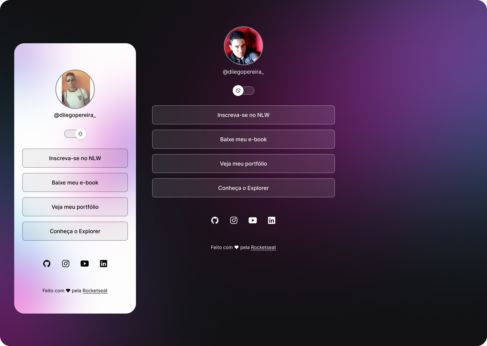
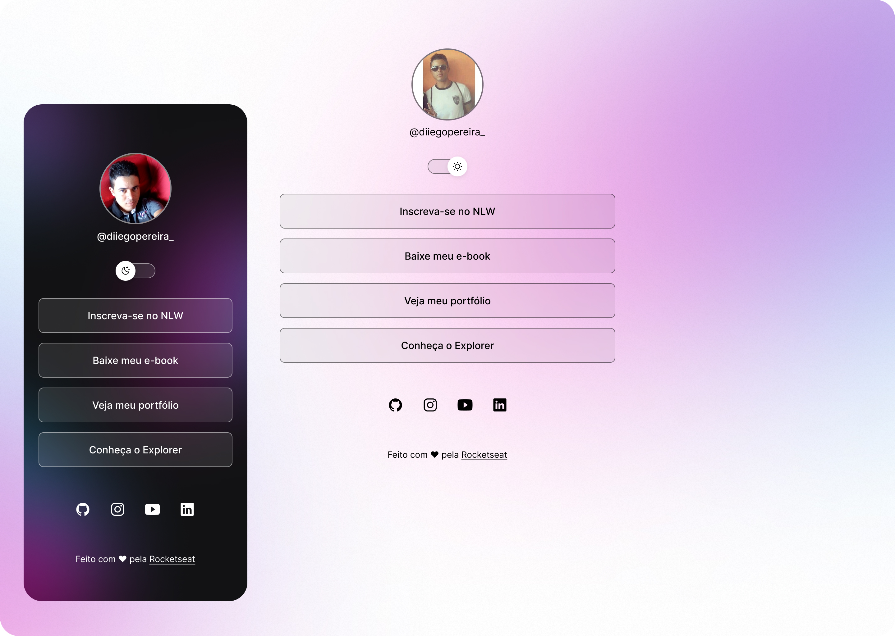

<h1 align="center"> DevLinks </h1>

  Uma réplica do programa gratuito, promovido pela Rocketseat para ensino de tecnologias WEB.

 

  <a href="#-tecnologias">Tecnologias</a>&nbsp;&nbsp;&nbsp;|&nbsp;&nbsp;&nbsp;
  <a href="#-projeto">Projeto</a>&nbsp;&nbsp;&nbsp;|&nbsp;&nbsp;&nbsp;
  <a href="#-layout">Layout</a>&nbsp;&nbsp;&nbsp;|&nbsp;&nbsp;&nbsp;
  <a href="#memo-licença">Licença</a>

 git

  

 
<h1 align="center"> Layout Desktop & Mobile</h1>

  

  

## 🚀 Tecnologias

Esse projeto foi desenvolvido com as seguintes tecnologias:

- HTML e CSS
- JavaScript
- Git e Github
- Figma

## 💻 Projeto

O Devlinks é um agregador de links para usar como cartão de visitas online.

## 🔖 Layout

Você pode visualizar o layout do projeto através 
### Original
[DESSE LINK](https://www.figma.com/community/file/1187422022288947321). 
### Prototipo alterado:
[DESSE LINK](https://www.figma.com/file/jyEiM5fHUv5j96sYeXNKX4/DevLinks-%E2%80%A2-Projeto-Discover-(Community)?type=design&node-id=10%3A620&t=9f1lYDhZDnl5b6dB-1) 
É necessário ter conta no [Figma](https://figma.com) para acessá-lo.

## :memo: Licença

Esse projeto está sob a licença MIT.

---

Feito com ♥ by Rocketseat :wave: [Participe da nossa comunidade!](https://discord.gg/rocketseat)